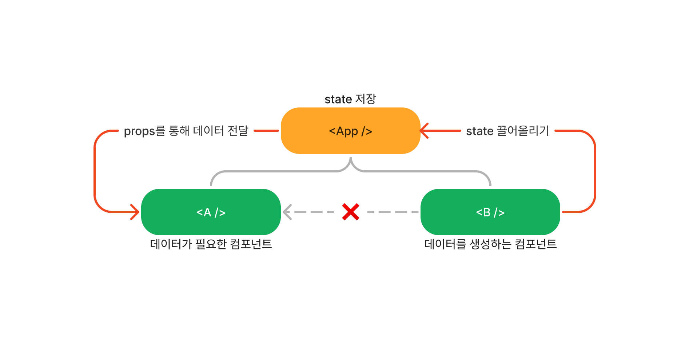

# React

## 리액트 프로젝트 생성하기

```md
npx create-react-app 프로젝트명

npm start
```

```
src
├─ App.js
├─ index.css
└─ index.js  --> 가장 먼저 실행되는 파일
```

### index.js 파일 파헤쳐보기

`import React from "react";`  
`import ReactDOM from "react-dom/client";`  
react-dom/client에서 ReactDom을 가져오고있다.  
즉, react-dom이라는 제 3의 라이브러리로부터 ReactDOM 객체를 가져오는 것(package.json 파일 dependencies에서 react, react-dom을 확인 할 수있다.)  
이 두개는 개별 패키지로 각기 다른 역할을 하지만 React 라이브러리라고도 볼 수 있으며 React 라이브러리로부터 같은 의존성을 갖는다.  
이를 통해 index.js 파일에서 해당 라이브러리가 제공하는 기능을 사용할 수 있다.
<br>
<br>

`createRoot` 메서드의 역할?  
React로 구축할 사용자 인터페이스인 React 애플리케이션을 불러온 웹 페이지 상에서 어디에 배치해야하는지 React에 알려준다.  
이 메서드를 통해 public 폴더에 있는 index.html 파일로 이동하는데 이 파일은 싱글 HTML 파일로 브라우저가 불러오는 파일이다.  
React 애플리케이션 전체에서 사용하는 유일한 HTML 파일(싱글 페이지 애플리케이션)

```js
// index.js 파일
const root = ReactDOM.createRoot(document.getElementById("root")); // ---> id가 root를 가진 이 코드가 아래의 div 태그를 의미한다.
root.render(<App />); // render 메서드를 통해 이 div 태그를 통해 뭘 랜더링 해야하는지 알려준다.

// index.html파일
<div id="root"></div>; // ---> 사용자 인터페이스가 렌더링 되어야 하는 부분
```

<br>

## JSX

<a href="https://ko.reactjs.org/docs/introducing-jsx.html">JSX React 공식문서</a>  
자바스크립트를 확장한 문법

**JSX의 역할**  
XML/HTML 코드를 자바스크립트로 변환하는 과정을 거치게 되는데 JSX 코드로 작성해도 최종적으로 자바스크립트 코드가 나온다.  
JSX를 자바스크립트 코드로 변환하는 역할을 함수는 `React.createElement()`  
아래 Hello 컴포넌트 예시를 보면 컴포넌트 내부에서 JSX를 사용한 부분이 `React.createElement()`라는 함수로 대체된 것을 볼 수 있다. JSX문법을 사용하면 리액트에서 내부적으로 `React.createElement()`라는 함수를 사용하도록 변환하고 최종적으로 `React.createElement()`를 호출한 결과로 자바스크립트 객체가 나오게 된다.

```js
// JSX를 사용한 코드
const element = <h1 className="greeting">Hello, world!</h1>;

// JSX를 사용하지 않은 코드
const element = React.createElement(
  "h1",
  { className: "greeting" },
  "Hello, world!"
);

// React.createElement()의 결과로 객체가 생성된다.
const element = {
  type: "h1",
  props: {
    className: "greeting",
    children: "Hello, world!",
  },
};
```

```js
// JSX를 사용한 코드
class Hello extends React.Component {
  render() {
    return <div>Hello {this.props.toWhat}</div>;
  }
}

ReactDOM.render(<Hello toWhat="world" />, document.getElementById("root"));

// JSX를 사용하지 않은 코드
class Hello extends React.Component {
  render() {
    return React.createElement("div", null, `Hello ${this.props.toWhat}`);
  }
}

React.render(
  React.creatElement(Hello, { toWhat: "World" }, null),
  document.getElementById("root")
);
```

- 함수형 컴포넌트와 클래스형 컴포넌트의 큰 차이점
  - 클래스 컴포넌트는 React.Component 클래스를 상속 받아서 만든다. (상속이라는 것은 객체지향 프로그래밍에서 나오는 개념인데 한 클래스의 변수들과 함수들을 상속받아서 새로운 자식 클래스를 만드는 방법)  
    위에서 Hello는 React.Component를 상속 받았기 때문에 결과적으로 리액트 컴포넌트가 되는 것이다.

<br>

### 리액트로 작성된 컴포넌트는 어떤 것일까?

단지 (HTML 코드를 리턴하는)자바스크립트 함수일 뿐이다.  
HTML 코드를 리턴하는 함수인 컴포넌트를 생성해서 내보내면(export) 되고, 사용하고싶은 파일에서 받아오면(import)되는데 JSX 코드에서 대문자로 시작하는 HTML 요소처럼 사용하면 된다.

<br>

### JSX 코드 안에서의 중요한 규칙

반환하는 문장마다 또는 JSX코드 조각마다 반드시 한 개의 루트 요소를 가져야한다. (여러개의 루트 요소를 가질 수 없고 하나의 루트 요소 안에서만 여러개의 요소들이 올 수 있다.)

```js
// 잘못된 방법
function Wrong() {
  return <div>Hello</div>
  <div><h1>My name is...</h1></div>
}

// 옳은 방법
function Correct() {
  return (
    <div>
      <div>Hello</div>
      <div>
        <h1>My name is...</h1>
      </div>
    </div>
  )
}
```

<br>

## props?

- props는 속성을 나타내는 데이터이다.
- 함수 컴포넌트에서 한 개의 매개변수만을 사용하는데 그 한 개의 매개변수는 프로퍼티로서 모든 속성을 받는 객체가 된다.
- 컴포넌트에 전달할 다양한 정보를 담고 있는 자바스크립트 객체

<br>

## 이벤트 핸들러 주의사항

```js
function Example() {
  const clickHandler = () => {
    console.log("clicked!");
  };
  return (
    <Component>
      <button onClick={clickHandler}>Change Button</button>
    </Component>
  );
}
```

위의 코드 `<button onClick={clickHandler}>Change Button</button>`에서 `clickHandler`를 지정했지만 실행하지 않았다.(괄호를 추가하지 않았다.)
`clickHandler` 함수를 지정했지만 실행을 하지 않았는데 만약, 실행을 했다면?

`<button onClick={clickHandler()}>Change Button</button>` 이 코드라인이 평가 되었을 때 자바스크립트는 이 코드라인을 실행했을 것이다. 그리고 JSX 코드가 반환될 때 아래 코드라인이 평가되는데

```js
<Component>
  <button onClick={clickHandler}>Change Button</button>
</Component>
```

그렇기에 클릭했을 때 `clickHandler`가 실행되는 것이 아니라 JSX 코드가 평가 될 때 실행되어서 클릭 전에 실행이 미리 되어버린다.
따라서 onClick을 위한 값으로 지정만 해놓고(실행은 하지 않기) 리액트는 이것을 기억했다가 클릭할 때마다 함수를 실행한다.

<br>

## Hooks?

| 함수 컴포넌트                       | 클래스 컴포넌트                       |
| ----------------------------------- | ------------------------------------- |
| state 사용 불가                     | 생성자에서 state를 정의               |
| 라이프 사이클에 따른 기능 구현 불가 | setState() 함수를 통해 state 업데이트 |
| **hooks**                           | 라이프 사이클 메서드 제공             |

클래스 컴포넌트는 state와 관련된 기능 뿐만 아니라 컴포넌트의 생명주기 함수들까지 정의가 되어있어 잘 가져다 쓰면 되는데, 기존 함수 컴포넌트는 클래스 컴포넌트와 다르게 간결하고 별도의 state를 가져다 쓰거나 컴포넌트 생명주기에 맞춰 코드를 실행할 수 없었다. 이러한 함수 컴포넌트를 지원사격하기 위해 Hook이라는 개념이 나왔고, Hook을 사용함으로써 함수 컴포넌트도 클래스 컴포넌트의 기능을 동일하게 사용할 수 있게 되었다.  
리액트의 state와 생명주기 기능에 갈고리를 걸어 원하는 시점에 정해진 함수를 실행하도록 만든 것이며 이때 실행되는 함수를 훅이라고 한다. (state / 생명주기 / 최적화 관련 함수 등)

### useState

```js
// 전반적인 리액트 객체를 임포트 했고 리액트 라이브러리에서 필요한 일부 라이브러리만 임포트하고 싶다면 {}안에 작성하기
// 현재 useState라는 함수를 임포트
import React, { useState } from "react";
```

`useState`는 리액트 라이브러리에서 제공하는 함수이다.  
컴포넌트 함수가 다시 호출되는 곳에서 변경된 값을 반영하기 위해 state로 값을 정의할 수 있게 해주는 함수이다.

**`useState` 함수를 사용하려면?**  
해당 컴포넌트 함수 안에서 `useState` 함수를 호출해야한다.  
함수 밖이나 중첩된 함수 안에서 호출할 수 없다. (컴포넌트 함수 안에서 직접적으로 호출되어야만 한다.)

`useState`는 특별한 종류의 변수를 생성하는데 이 변수는 변경사항으로 인해 컴포넌트 함수가 다시 호출되도록 한다.  
`useState`는 어떤 값을 반환하는데 이 값은 특별한 변수에 접근할 수 있게 해주며, 그 변수에 새로운 값을 할당할 수 있게 호출할 수 있는 함수도 반환한다.(첫 번째 값이 변수 자체인 배열 반환하며, 배열의 두번째 요소는 업데이트 되는 함수)  
`useState`는 항상 두개의 요소가 있는 배열을 반환한다.

```js
const [현재 상태 값, 업데이트하는(setter)함수] = useState(초깃값)
```

**useState 동작 방식?**  
내가 호출한 컴포넌트 함수는 해당 state를 업데이트하는 함수인데 useState로 상태를 초기화 했던 곳에서 다시 실행된다.  
state가 변할 때 해당 컴포넌트 함수를 다시 호출하고싶으면 state를 업데이트하는 함수(setter)를 호출하면 된다.  
setter함수를 호출해서 해당 state에 새로운 값을 할당하고 싶다고 리액트에게 말하고 그 다음 setter함수는 useState로 state가 등록된 컴포넌트는 재평가 되어야한다고 리액트에게 말한다.  
그래서 리액트는 컴포넌트 함수를 다시 실행하고 JSX 코드도 다시 평가한다.  
그런 후 이전과 비교하여 감지된 변화들을 화면에 나타나게 해준다.

<br>

**state 자세하게 알아보기**

```js
// App.js 파일
const App = () => {
  return (
    <>
      <Component title="ONE" />
      <Component title="TWO" />
      <Component title="THREE" />
    </>
  );
};

// Component.js 파일
const Component = (props) => {
  const [title, setTitle] = useState(props.title);

  function clickHandler() {
    setTitle("Update!");
  }

  return (
    <div>
      <h2>{title}</h2>
      <button onClick={clickHandler}>BUTTON</button>
    </div>
  );
};
```

버튼을 누르면 제목이 Update!로 바뀌는 예제 코드를 간단하게 작성해보았다.  
useState는 state값을 등록하고 호출된 컴포넌트를 위한 것이다.  
특정 컴포넌트의 인스턴스를 위해 state를 등록하는데 예를들어,  
Component.js 파일에서 Component는 한 번 정의했지만 App.js 파일에서 App은 세개의 `<Component />`를 생성했고 `<Component />`를 세 번 호출했다.  
매번 호출할 때마다 동일한 방법으로 새로운 별도의 state가 생성되지만 리액트에 의해 독립적으로 관리된다.  
만약 첫 번째 `<Component />`에서 title을 변경해도 다른 아이템들은 영향을 받지 않는데 이는 자신들만의 state를 가지고있기 때문이다.  
(컴포넌트별 인스턴스 기반으로 해서 독립적인 state를 갖는다.)

**const 사용하는 이유?**  
위의 코드에서 `const [title, setTitle] = useState(props.title);` 새로운 값을 할당할 때 상수를 사용했다.  
state를 업데이트 할 때 아래 코드 주석 부분처럼 등호를 사용해서 값을 할당하지 않는데 이는 새로운 값을 할당하는 방법이 아니다.

```js
function clickHandler() {
  // title = Update! // 잘못 된 방법
  setTitle("Update!");
}
```

대신 state를 업데이트하는 setter 함수를 호출하는데 useState를 호출해서 리액트에게 어떤 값을 관리한다고 선언한다.  
그래서 상수형을 써도 무방하다.

그럼 가장 최신의 값을 어떻게 가져오는 걸까?  
컴포넌트형 함수에서는 state가 업데이트 되면 재실행이 되는데 컴포넌트형 함수가 다시 실행될 때마다 `const [title, setTitle] = useState(props.title);` 이 부분이 다시 실행된다.  
그래서 setTitle을 호출해서 새로운 title을 할당하면 `<Compnent />`를 다시 불러오게 되고 업데이트 된 title은 state를 관리하는 리액트에서 가져온다.  
리액트는 useState가 반환하는 배열에서 가장 최신의 상태를 우리에게 제공하는데 그래서 컴포넌트가 재실행될 때마다 항상 최신 상태의 화면을 갖게 된다.  
리액트는 처음으로 주어진 컴포넌트 인스턴스에서 useState를 호출할 때 기록하는데, 그래서 우리가 처음 호출 할 때 해당 인자를 초깃값으로 취하는 것이고(`useState(초깃값)`), 컴포넌트가 재실행 되었을 때 그땐 상태가 변했기 때문에 리액트는 state를 다시 초기화하지 않는다.(초깃값은 처음으로 컴포넌트형 함수가 실행될 때만 고려되는 값이다.)  
대신 상태가 초기화 됐던 것을 추적하여 어떤 state가 업데이트 되었는지 확인하고 최신의 state를 제공한다.

**useState 간략하게 총 정리**  
useState를 사용해서 상태를 등록하면 항상 두 개의 값을 얻는데 현재 상태값과 업데이트하는 함수이다. 그리고 state가 변할 때마다 업데이트 함수를 호출한다. JSK코드에서 변한 값을 출력하기 위해 상태값을 사용하고싶을 때마다 첫번째 요소를 사용한다.  
이제 리액트가 나머지 작업을하는데 상태가 변할 때마다 컴포넌트형 함수를 다시 실행하고 JSX코드를 다시 평가한다.

응용프로그램에 반응성을 추가하는것이 state이고, state가 없다면 사용자 인터페이스는 변하지 않기 때문에 중요하다.

<br>

## State 끌어올리기(Lifting State Up)

데이터를 자식 컴포넌트에서 부모 컴포넌트로 이동하는 방법  
props를 사용해서 부모 컴포넌트로부터 함수를 받고 자식 컴포넌트에서 그 함수를 불러온다.



A와 B를 렌더링 하는 App 컴포넌트가 있는데 B컴포넌트는 몇몇 데이터를 생성하는 컴포넌트라고 해보자. B컴포넌트에서 데이터를 생성하고 있지만 B컴포넌트에서 그 데이터를 사용하지 않을 수 있고 다른 컴포넌트에서 B컴포넌트가 생성한 데이터가 필요할 수 있다.  
만약 A컴포넌트에서 B컴포넌트가 생성한 데이터가 필요하다면 B컴포넌트에서 A컴포넌트로 데이터를 주고싶지만 두 형제 컴포넌트는 직접적으로 연결되어 있지 않아 데이터를 주고 받을 수 없다.  
부모->자식, 자식->부모로만 소통 가능하여 가장 가까운 부모 컴포넌트를 활용하여 데이터를 주고 받을 수 있다.  
state를 가장 가까운 관련된 컴포넌트에 저장할 수 있기 때문에 B컴포넌트에서 생성된 상태 데이터를 끌어올려 App컴포넌트에 전달한다.  
따라서 상태 끌어올리기는 자식 컴포넌트에서 어떤 부모 컴포넌트로 데이터를 이동해서 부모에서 사용하거나, 다른 자식 컴포넌트로 데이터를 전달하는 것이다.  
항상 루트 App 컴포넌트까지 상태를 끌어올려야 하는 것은 아니고 컴포넌트 트리에서 필요한 만큼 끌어올리면 되는데, 데이터를 생성하는 컴포넌트와 데이터가 필요한 컴포넌트에 접근할 수 있으면 된다.

<br>

### keys?

리액트는 데이터의 목록을 렌더링하는데 있어서 리액트가 발생할 수 있는 어떤 성능 손실이나 버그 없이 효과적으로 목록들을 업데이트하고 렌더링할 수 있도록 한다.

목록에 새 아이템을 추가했을 때 리액트는 이 새로운 아이템을 목록에 있는 마지막 아이템으로 렌더링하고 모든 아이템을 업데이트해서 컨텐츠를 교체하는데, 이렇게 되면 추가한 새 아이템이 특정 state를 가지고 있었다면 새 아이템은 이전 아이템을 덮어쓰는 문제(기존에 있던 어떤 상태의 변화는 사라짐), 성능 이슈, 버그 발생하는 문제가 있다.

리액트는 모든 아이템을 식별할 수 있고 key를 추가함으로써 배열의 길이 뿐만 아니라 아이템이 위치해야할 곳까지 인식하여 효율적인 방법으로 업데이트할 수 있다. 따라서 목록의 아이템을 맵핑할 때는 항상 key를 추가해야한다.

<br>

## useEffect

- side effect를 수행하기 위한 Hook

**side effect?**  
서버에서 데이터를 받아오거나 수동으로 DOM을 변경하는 등의 작업을 effect라고 하는데
이러한 작업들은 다른 컴포넌트에 영향을 미칠 수 있으며, 렌더링 중에는 작업이 완료될 수 없고 렌더링이 끝난 이후에 실행되어야하는 작업들이다.  
이런 작업들이 side에서 실행된다는 의미에서 side effect라고 불리며 useEffect는 리액트의 함수 컴포넌트에서 side effect를 실행할 수 있게 해주는 Hook이다.
<br>

useEffect는 클래스 컴포넌트에서 제공하는 생명주기 함수인 `componentDidMount()`, `componentDidUpdate()`, `componentWillUnmount()`와 동일한 기능을 하나로 통합하여 제공해서 useEffect하나로 생명주기 함수와 동일하게 사용할 수 있다.

```js
useEffect(이펙트 함수, 의존성 배열)

// 의존성 배열?
// 해당 effect가 의존하고 있는 배열을 의미하는데 배열 안에 있는 변수 중에 하나라도 값이 변경되었을 때 이펙트 함수가 실행된다.
// 이펙트 함수는 컴포넌트가 렌더링 된 이후와 업데이트로 인한 재렌더링 이후에 실행된다.
```

```js
// 이펙트 함수가 마운트, 언마운트 시에 단 한번만 실행되게 하고싶다면 의존성 배열에 빈 배열을 넣으면 된다. 이렇게하면 해당 이펙트가 props나 state에 있는 어떠한 값에도 의존하지 않는 것이므로 여러번 실행되지 않는다.
useEffect(이펙트 함수, [])

// 의존성 배열을 생략하면 컴포넌트가 업데이트 될 때마다 호출된다.
useEffect(이펙트 함수)
```

useEffect 정리

```js
useEffect(() => {
  // 컴포넌트가 마운트 된 이후,
  // 의존성 배열에 있는 변수들 중 하나라도 값이 변경되었을 때 실행됨
  // 의존성 배열에 빈 배열([])을 넣으면 마운트와 언마운트시에 단 한번씩만 실행됨
  // 의존성 배열 생략 시 컴포넌트 업데이트 마다 실행 됨
  ...

  return () => {
    // 컴포넌트가 마운트 해제되기 전에 실행 됨
    ...
  }
}, [의존성변수1, 의존성변수2, ...])
```

<br>
<br>

# 🧐 Quiz

```

Q. React.js에서는 어떤 유형의 코드로 작성하나요?
A. 선언형(Declarative) JavaScript 코드

React.js를 사용할 때는 목표, 즉 화면에 무엇이 표시되어야 하는지를 정의하고 React가 거기까지 도달하는 방법을 알아내도록 만들어야 합니다.

```

```

Q. “JSX”란 무엇일까요?
A. React 프로젝트에서만 활성화되는 특수한 비표준 구문이다.

“create-react-app”으로 생성한 React 프로젝트와 같이 React 프로젝트는 JSX 구문을 지원합니다.
백그라운드에서 표준 JS 코드로 컴파일됩니다.

```

```

Q. 왜 “컴포넌트”를 React의 모든 것이라고 할까요?
A. 모든 UI는 결국 여러 컴포넌트로 구성되며, 따라서 사용자 인터페이스를 "컴포넌트의 조합"이라고 생각할 수 있다.

“컴포넌트”는 사용자 인터페이스에 관한 사고 방식일 뿐입니다. React는 이러한 개념을 아우르며 컴포넌트를 구축할 수 있는 도구를 제공합니다.

```

```

Q. “선언형”은 무슨 뜻인가요?
A. 원하는 결과(대상 UI 등)를 정의하고 라이브러리(React)가 단계를 구성한다.

대상의 “상태(UI)”를 정의하면 해당 결과를 얻기 위해 어떤 JS 명령어를 실행해야 하는지를 React가 특정합니다.

```

```

Q. “React 컴포넌트”란 무엇일까요?
A. 일반적으로 해당 컴포넌트가 사용될 때 화면에 표시되는 HTML(정확히는 JSX) 코드를 반환하는 JS 함수이다.

```

```

Q. React 앱은 커스텀 React 컴포넌트를 몇 개 가져야 하나요?
A. 사용자 마음대로

원하거나 필요한 만큼 리액트 컴포넌트를 가질 수 있습니다.

```

```

Q. 올바른 문장은 무엇인가요?
A. React를 사용해서 DOM 노드에 마운트되는 하나의 루트 컴포넌트를 가진 컴포넌트 트리를 구축한다.

```

```

Q. “컴포넌트 트리”란 무엇을 뜻하나요?
A. 루트노드 아래에 여러 컴포넌트가 중첩되어 있는 것을 뜻한다.

표준 HTML 문서를 구축할 때 HTML 트리를 구축하는 것처럼 컴포넌트를 서로 중첩해 트리를 구축합니다.

```

```

Q. 어떻게 컴포넌트 간에 데이터를 전달하나요?
A. "프로퍼티"라고 잘 알려진 "커스텀 HTML 속성을 통해

고유한 “HTML 요소”를 구축하므로 고유한 속성(React에서는 “프로퍼티”라고 함)을 정의할 수 있습니다.

```

```

Q. React 컴포넌트 내부의 동적 데이터(반환된 JSX 코드)는 어떻게 출력하나요?
A. 아무 JS 표현식을 단일 중괄호{}로 감싸 사용한다.

중괄호 사이에 블록 문(예: if 문)을 넣을 수는 없지만, 이 특수 기능을 사용하면 모든 JS 표현식의 결과를 출력할 수 있습니다.

```

## 리액트?

- 사용자 인터페이스를 만들기 위한 자바스크립트 라이브러리

**사용자 인터페이스?**

- 사용자와 컴퓨터 프로그램이 서로 상호작용을 하기위해 중간에서 서로간의 입력과 출력을 제어해 주는 것

**라이브러리?**

- 특정 프로그래밍 언어에서 자주 사용되는 기능을 모아놓은 것

**프레임워크 vs 라이브러리**
크게 프로그램의 흐름에 대한 제어 권한이 누구에게 있냐로 구분

- 프레임워크 : 프로그램의 흐름에 대한 제어 권한이 개발자가 아닌 프레임워크 자신이 가지고 있음
- 라이브러리 : 프로그램의 흐름에 대한 제어 권한이 개발자에게 있음, 흐름에 대한 제어를 하지 않고 개발자가 필요한 부분만 필요할 때 가져다 쓰는 형태

**장점**

1. 빠른 업데이트와 렌더링 속도

- Virtual DOM(가상 돔)
  - 일단 DOM은 웹 페이지를 정의하는(웹사이트의 정보를 모두 담고있는) 하나의 객체인데 Virtual DOM은 웹 페이지와 실제DOM 사이에서 중간 매개채 역할을 한다.
    일반적으로 사용자와 상호 작용을하는 웹 페이지의 경우 화면의 업데이트가 수시로 이루어지는데 이는 DOM이 계속 수정된다는 것을 의미한다. 이렇게 업데이트를 하면 DOM을 직접 수정하게 되면서 성능에 크게 영향을 미치고 비용도 많이 드는 작업이다.
    반면에 리액트는 DOM을 직접 수정하는 것이 아니라 업데이트할 최소한의 부분만 찾아서 업데이트한다.

2. 컴포넌트 기반

- 리액트는 모든 구성요소가 컴포넌트로 구성되어 있고 하나의 컴포넌트는 또 다른 여러개의 컴포넌트 조각으로 구성될 수 있다.

3. 재사용성

- 재사용성을 높인다는 것은 다른 모듈에 대한 의존성을 낮추고 호환성 문제가 발생하지 않도록 개발해야한다
  - 비슷한 소프트웨어를 개발한다고 했을 때 기존에 개발해둔 모듈을 재사용하면 되기 때문에 개발 기간이 단축된다.
  - 여러 소프트웨어에서 공통으로 사용하는 모듈에 문제가 생기면 해당 모듈만 수정하면 되기 떄문에 유지 보수가 용이하고 버그를 보다 쉽게 찾을 수 있다.

**단점**

1. 높은 상태관리 복잡도

- 바뀐 부분만 찾아서 업데이트한다 했는데 state가 바뀐 컴포넌트를 의미한다. 웹 사이트의 규모가 커져 컴포넌트 양이 많아지면 그만큼 상태관리의 복잡도가 증가한다. 상태관리를 위해 상태관리 라이브러리(redux, recoil...)를 사용하기도 한다.

<br>
<br>

## Rendering Elements

### Elements?

- 어떤 물체를 구성하는 성분
- React Element도 리액트 앱을 구성하는 요소를 의미한다.

**React Element vs DOM Element**
|Virtual DOM||Browser DOM|
|-|-|-|
|React Elements|--render-->|DOM Elements|

리액트 엘리먼트의 렌더링 과정은 virtual DOM에서 실제 DOM으로 이동하는 과정이라고 볼 수 있다.

```js
// 이 코드가 실행 될 때 대입연산자의 오른쪽 부분은 리액트의 creatElement를 사용하여 엘리먼트를 생성하게 된다. 이렇게 생성된 것이 리액트 엘리먼트.
// 리액트는 이 엘리먼트를 이용해서 실제 화면에서 보여질 DOM Element를 생성한다.

const element = <h1>Hello, world</h1>;
ReactDOM.render(element, document.getElementByID("root"));
```

### Elements의 생김새

- 리액트 엘리먼트는 자바스크립트 객체 형태로 존재한다. (컴포넌트의 유형과 속성 및 내부의 모든 자식 요소의 정보를 담고있는 객체, 마음대로 바꿀 수 없는 불변성)
- 엘리먼트가 불변성을 갖고있다는 것은 한번 생성된 엘리먼트는 변하지 않는다는 것이다. (엘리먼트 생성후에는 children이나 attributes를 바꿀 수 없다.)
  - Q. 한번 생성된 엘리먼트는 바꿀 수 없다고 했는데 그럼 화면이 바뀌어야 할 때 갱신이 안되는거 아닌가요?  
    A. 붕어빵 틀을 컴포넌트, 틀에서 구워져 나온 붕어빵을 엘리먼트라고한다면 이미 구워져 나온 붕어빵은 엘리먼트 생성이 완료된 것이므로 바꿀 수가 없다. 그렇기 때문에 화면의 변경된 엘리먼트들을 보여주기 위해서는 기존의 엘리먼트를 변경하는게 아니라 새로운 엘리먼트를 만들어서 기존 엘리먼트와 교체해야하는 것이다.

## State?

- 리액트 컴포넌트의 변경 가능한 데이터
- state는 개발자가 정의한다.
- 렌더링이나 데이터 흐름에 사용되는 값만 state에 포함시켜야한다. (state가 변경될 경우 컴포넌트가 재렌더링 되기 때문에 렌더링과 데이터 흐름에 관계없는 값을 state에 포함시키면 불필요한 경우에 컴포넌트가 재렌더링 되어 성능 저하에 원인이 된다.)
- state는 자바스크립트 객체이다.

```js
class LikeButton extends React.Component {
  // constructor: 클래스가 생성될 때 실행되는 함수
  constructor(props) {
    super(props);

    // 현재 컴포넌트의 state를 정의하는 부분
    this.state = {
      liked: false
    }
  }
  ...
}
```

- state는 직접 수정할 수 없다. (수정이 가능하긴 하지만 하면 안됨)

```js
// state를 직접 수정 (잘못된 사용법)
this.state = {
  name: "Wang",
};

// setState 함수를 통한 수정 (올바른 사용법)
this.setState({
  name: "Wang",
});
```

<br>
<br>

## LifeCycle

### 리액트 클래스 컴포넌트의 생명주기

컴포넌트가 계속 존재하는 것이 아닌, 시간의 흐름에 따라 생성되고 업데이트 되다가 사라진다.


하단의 초록색 부분(`componentDidMount`, `componentDidUpdate`, `componentWillUnmount`)은 생명주기에 따라 호출되는 클래스 컴포넌트의 함수(라이프사이클 메서드, 생명주기 함수)

- 컴포넌트가 생성되는 시점(Mount) : 이 때 constructor(생성자)가 실행된다. 생성자에서 컴포넌트의 state를 정의한다. 컴포넌트가 렌더링되며 이후에 `componentDidMount()`가 호출 된다.
- Update : 컴포넌트의 props가 변경되거나 setState함수 호출에 의해 state가 변경되거나 forceUpdate함수(강제 업데이트 함수)로 인해 컴포넌트가 다시 렌더링 된다. 렌더링 이후에 `componentDidUpdate()`가 호출된다.
- 컴포넌트가 사라지는 시점(Unmount) : 상위 컴포넌트에서 현재 컴포넌트를 더이상 화면에 표시하지 않을 때 Unmount가 된다. Unmount 직전에 `componentWillUnmount()`가 호출된다.
